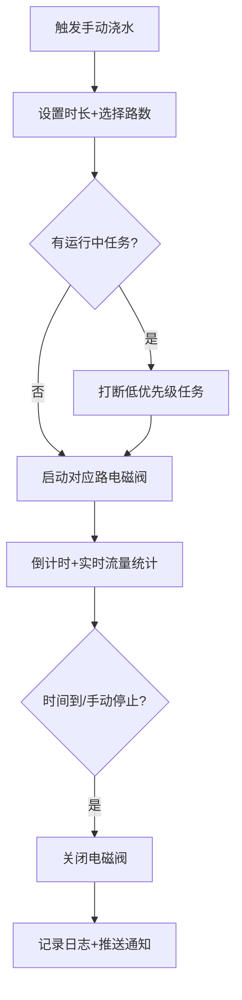
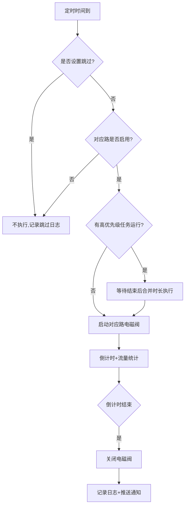
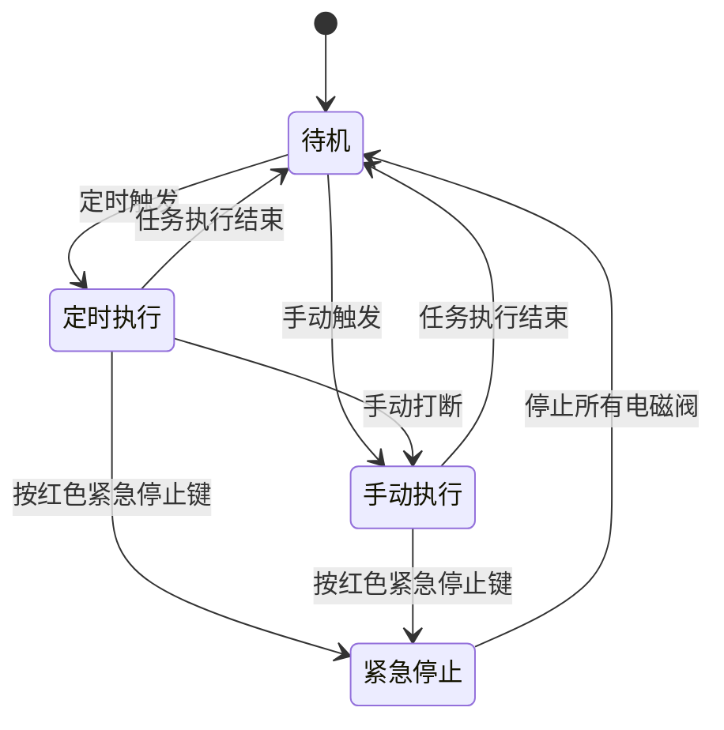

# 03-软件需求规格说明书
## 第一章 核心功能逻辑设计（总览+流程图）
本系统核心功能为4路独立智能浇水，优先级规则：**紧急停止 > 手动浇水 > 定时浇水**，高优先级可打断低优先级任务，所有浇水任务强制带倒计时，无永久开启模式。
---
### 1.1 手动浇水全流程逻辑
支持3种触发方式：本地按键、Web/APP操作、API调用，全流程逻辑一致。

#### 文字步骤说明：
1. 选择触发方式，设置浇水时长（1-240分钟）和需要开启的路数，支持多选，每路可独立设不同时长
2. 如果有正在运行的定时任务，直接打断，优先执行手动任务
3. 启动电磁阀，开始倒计时，实时统计流量
4. 倒计时结束或者手动停止时，关闭电磁阀，记录本次浇水日志，推送通知
---
### 1.2 定时任务全流程逻辑
最多支持20个定时任务，3种循环模式：每天/每周自定义/间隔N天。

#### 文字步骤说明：
1. 定时时间到，检查是否设置了跳过当天/未来N天的规则，是则不执行
2. 检查任务对应的路是否已启用，未启用则不执行
3. 如果当前有更高优先级的手动任务在运行，等待手动任务结束后合并时长执行
4. 启动电磁阀，倒计时结束后关阀，记录日志
---
### 1.3 状态优先级流转规则

---
## 第二章 详细功能逻辑
### 2.1 浇水控制
- **浇水模式可配置**：支持两种模式，Web/本地菜单可切换：
  1. 并行模式（默认）：多路同时开启浇水，适合水压足够场景
  2. 串行模式：多任务触发时按路数顺序依次执行，同时间仅开一路，每路结束间隔10秒再开下一路，适合水压不足场景
- 每路电磁阀独立控制，开启时对应路状态标记为1，流量计数开始
- 浇水时长到、手动停止、紧急停止时关闭电磁阀，停止计数，写入记录
- 异常检测：
  1. 浇水启动后**默认30秒**无流量脉冲，判定为水流异常，关闭电磁阀，记录异常日志，LED快闪；检测时长支持1-60秒自定义配置
  2. 待机状态下10秒内检测到≥3个流量脉冲，判定为漏水/电磁阀故障粘连，触发告警：LED快闪、推送通知、记录异常日志

### 2.2 定时任务
- 任务存储结构：任务ID、触发时间（HH:MM）、路数、时长、循环模式、启用状态
- 循环模式处理：
  - 每天模式：每天到点触发
  - 每周模式：匹配星期几触发
  - 间隔模式：上次执行后间隔N天触发
- 任务冲突：多个任务同时触发时，合并浇水时长，按路数同时开启

### 2.3 流量校准
- 每个路存储独立校准系数，默认值1.0，范围0.5-2.0
- 傻瓜校准流程：选择路→启动校准模式→放水→输入实际水量→系统自动计算系数=实际水量/统计水量
- 进阶校准：直接手动输入校准系数，保存到Flash

## 第三章 系统功能逻辑
### 3.1 动态休眠
- 活跃计时器初始值10分钟（可配置）
- 按键操作、Web访问、API调用、浇水动作时重置计时器为10分钟
- 计时器>0时：系统全速运行，不休眠
- 计时器=0时：进入Modem-sleep模式，休眠间隔1s，保持WiFi连接和Web服务正常

### 3.2 免打扰
- 配置免打扰开始/结束时间，RTC时间在时段内时，不推送任何通知
- 本地提示、功能不受影响，仅禁止远程推送

### 3.3 扩展API支持
- 不内置天气预报功能，开放全量原子控制API，支持外部系统对接
- 外部系统（天气服务、智能家居等）可通过API实现任意扩展功能，比如根据降雨情况控制浇水、根据温度调整时长等，无需修改控制器核心代码
- API采用Token鉴权机制，确保操作安全，仅局域网可访问

### 3.4 OTA升级
- 支持Web页面固件升级，用户上传.bin固件即可自动完成升级
- 升级过程有进度显示，升级失败自动回滚到原有固件，不会变砖
- 仅局域网内可升级，结合API鉴权，确保安全
### 3.5 恢复出厂
- 仅恢复配置：重置所有参数为默认值，保留浇水记录和日志
- 恢复所有：重置参数+清空所有记录和日志，回到出厂状态

## 第四章 数据存储逻辑
### 4.1 Flash分区规划（4MB，兼顾OTA、寿命、存储需求）
| 分区 | 大小 | 用途 | 说明 |
|------|------|------|------|
| 引导/分区表 | 64KB | 系统默认 | 标准ESP32分区 |
| 固件A区（运行区） | 1.5MB | 当前运行固件 | 足够容纳Arduino大固件，余量充足 |
| 固件B区（OTA备份区） | 1.5MB | OTA升级暂存新固件 | 双备份升级，失败自动回滚 |
| 参数存储区 | 64KB | 系统参数、定时任务、校准系数、枚举映射表 | 余量充足，支持多备份轮流存储提升寿命 |
| 日志/记录区 | 832KB | 存储浇水记录+系统日志 | 最多存1万条记录，循环覆盖 |
| 系统预留区 | 64KB | 校准数据、WiFi配置 | 标准预留 |
### 4.2 存储结构设计（紧凑二进制，磨损均衡）
1. **紧凑二进制存储**：
   - 浇水记录：每条固定12字节，包含时间戳、路数、时长、水量、状态
   - 系统日志：每条固定8字节，包含时间戳、类型、事件枚举、参数
   - 用数字枚举代替字符串存储，导出时通过映射表转成可读文字，大幅压缩体积
2. **磨损均衡设计（寿命提升200倍）**：
   - 日志区采用环形扇区轮换写入，208个4KB扇区循环写，擦写均匀分布，避免集中磨损
   - 批量写入：数据先攒到RAM缓冲区，满512字节再一次性写入Flash，减少80%擦写次数
   - 参数区多备份轮流存储，避免反复擦写同一个扇区
3. **存储限制**：浇水记录+系统日志合计最多存1万条，满了自动覆盖最早记录，剩余空间留作安全余量
4. **掉电保护**：写入操作前先备份旧数据，异常掉电不损坏存储内容
