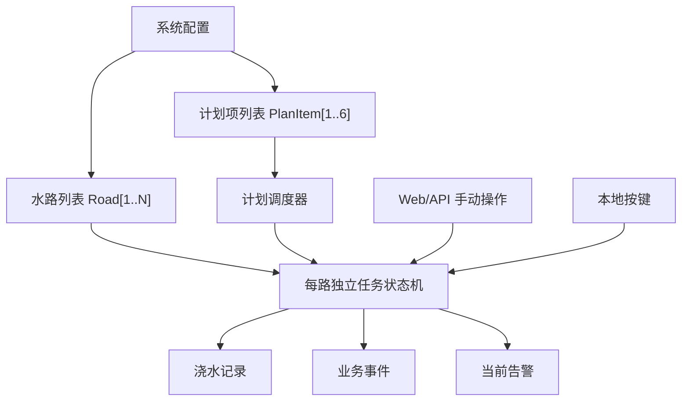
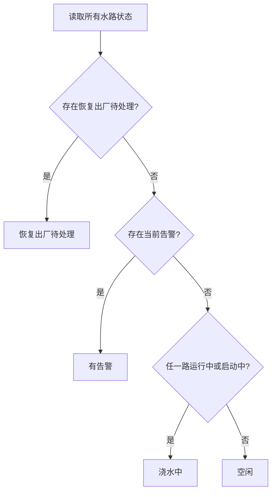
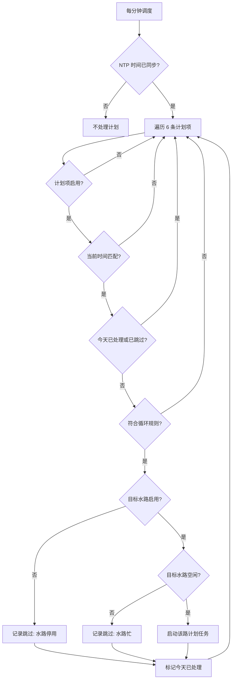
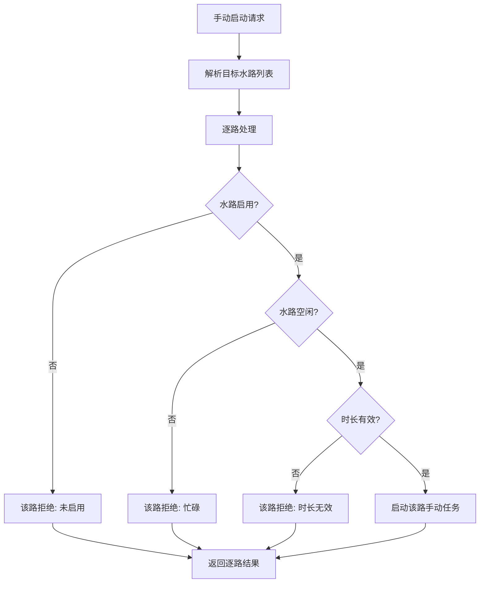
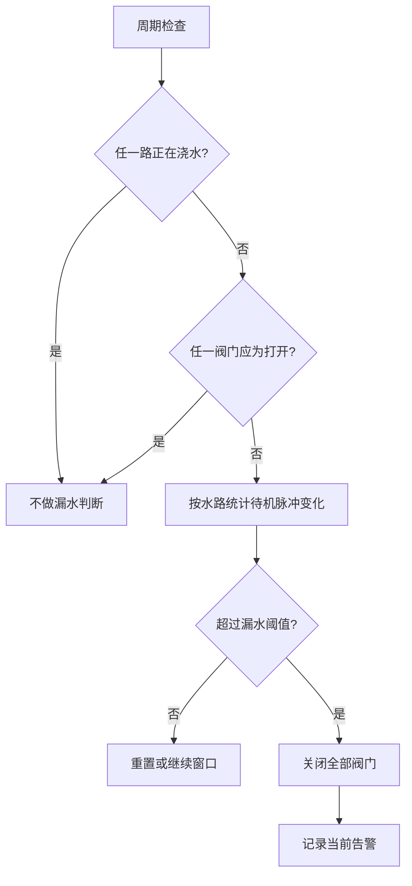

# 灌溉系统核心逻辑说明

本文档定义灌溉系统后续应采用的核心业务模型，用于继续讨论和指导实现重构。当前代码中仍有部分逻辑保留旧的“两路会话模型”，后续应逐步调整到本文档描述的“多路独立水路任务模型”。

最后更新：2026-05-28

## 一、核心结论

系统的核心对象不是“一次浇水会话”，而是“水路”。每一路水路独立开阀、关阀、计时、统计流量、处理异常和记录结果。

计划不是一个复杂的多路会话，计划只是按时间触发某一路浇水任务。手动浇水也不是系统大状态，手动只是给某一路发起一个即时浇水任务。

最终核心规则如下：

- 支持 N 路水路，当前硬件实例按 2 路配置并默认启用 2 路，未来可扩展到 4 路或更多。
- 每一路独立运行，同一路互斥，不同路可并行。
- 同时浇水和顺序浇水不再是执行模式，而是由每一路计划的启动时间自然表达。
- 计划项是单路计划项，一条计划项只控制一路水。
- 手动任务和计划任务使用同一套路级任务状态机。
- 流量统计、无水异常、停止、告警和记录都以水路为基本单位。
- 系统状态由所有水路状态派生，不单独维护“手动浇水中”和“计划浇水中”两个大状态。

## 二、设计目标

这个模型要解决三个问题：

1. 保持核心逻辑简单。系统本质是管理多个电磁阀按时开关，不应引入重型会话概念。
2. 支持自然扩展。增加水路数量时，业务逻辑只增加数组长度，不增加状态机复杂度。
3. 让用户操作符合直觉。某一路正在计划浇水时，其他空闲水路仍然可以手动启动；忙的是某一路，不是整个系统。

## 三、总体模型



系统可以有多个水路，但所有水路都使用同一套逻辑。水路数量不改变业务规则。

## 四、水路对象

水路是系统最重要的业务对象。每一路至少包含以下信息：

```text
Road
- id
- 名称
- 是否启用
- 电磁阀控制引脚
- 流量计脉冲引脚
- PWM 配置
- 流量计量配置
- 当前任务
- 当前状态
- 当前告警
```

### 1. 水路启用状态

启用表示这一路当前允许参与浇水。停用表示这一路不允许启动新任务。

停用水路仍属于系统结构的一部分，页面可以继续显示它，但操作按钮应不可用，计划调度也应跳过它。

### 2. 引脚配置

每增加一路水路，硬件上至少需要两类引脚：

- 一个电磁阀控制输出引脚。
- 一个流量计脉冲输入引脚。

电磁阀控制输出建议按 PWM 能力设计，因为后续需要支持“启动全功率 + 保持低功率”的控制方式。流量计输入需要支持可靠的脉冲计数。

引脚可以设计成可配置，但不能允许用户随意选择任意 GPIO。系统必须有板级能力约束：

- 哪些 GPIO 可以作为电磁阀 PWM 输出。
- 哪些 GPIO 可以作为流量计输入。
- 哪些 GPIO 已被 I2C、按键、启动脚、基础库或其他外设占用。
- 哪些 GPIO 禁止用于阀门或流量计。
- 同一个 GPIO 不能被多处重复使用。

当前阶段可以先保留固定板级配置；后续如果做成页面可配置，也必须基于“候选引脚列表 + 冲突校验”实现。

### 3. PWM 控制配置

电磁阀控制不是简单的高低电平概念，建议按以下参数建模：

```text
ValvePwmConfig
- pwmPin
- pwmChannel
- pwmFrequency
- pullInDuty
- pullInMs
- holdDuty
- offDuty
```

含义：

- `pullInDuty`：开阀初期吸合占空比，通常接近或等于 100%。
- `pullInMs`：全功率吸合保持时间。
- `holdDuty`：吸合后保持占空比，用于降低线圈发热。
- `offDuty`：关阀占空比，通常为 0。

占空比和频率必须根据具体电磁阀、电源、电磁阀驱动电路和实测温升确定，不能只凭经验固定为某个值。ESP32 GPIO 不能直接驱动电磁阀，PWM 输出只能驱动 MOSFET、继电器模块或专用驱动器。

## 五、任务对象

任务是某一路正在执行或刚执行完的一次浇水动作。

```text
RoadTask
- taskId
- roadId
- 任务类型：手动 / 计划
- 触发来源：Web/API / 本地按键 / 调度器
- 关联计划项 id，可为空
- 目标时长
- 开始时间
- 结束时间
- 开始脉冲数
- 结束脉冲数
- 估算水量
- 结束原因
```

任务类型回答“这是手动还是计划”。触发来源回答“是谁触发了它”。

因此，本地按键不是第三种任务类型。本地按键触发的是手动任务，只是触发来源为本地按键。Web/API 触发的也是手动任务，触发来源为 Web/API。

## 六、路级状态机

每一路都有自己的状态机：

```mermaid
stateDiagram-v2
    [*] --> 停用
    [*] --> 空闲

    停用 --> 空闲: 启用水路
    空闲 --> 停用: 停用水路

    空闲 --> 启动中: 启动任务
    启动中 --> 运行中: 打开阀门成功
    启动中 --> 异常: 打开阀门失败

    运行中 --> 完成: 到达目标时长
    运行中 --> 已停止: 手动停止本路
    运行中 --> 异常: 无水/硬件异常
    运行中 --> 已停止: 停止全部

    完成 --> 空闲: 记录完成
    已停止 --> 空闲: 记录完成
    异常 --> 空闲: 异常确认或任务收尾
```



同一路互斥：只要该路处于启动中或运行中，就不能再启动新的任务。
不同路独立：第 1 路运行中，不影响第 2 路启动手动或计划任务。

## 七、系统状态

系统状态不是手动维护的复杂状态机，而是由所有水路状态派生：



系统不再区分“手动浇水中”和“计划浇水中”。如果需要显示来源，在每一路任务上显示：

- 第 1 路：计划浇水中。
- 第 2 路：手动浇水中。
- 第 3 路：空闲。

这样比全局状态更准确。

## 八、计划模型

计划应改为“单路计划项”，而不是“一条计划同时包含多路时长”。

```text
PlanItem
- id
- 是否启用
- roadId
- 启动时间
- 目标时长
- 循环规则
- 最近一次处理日期
```

系统最多支持 6 条计划项。

计划项只负责一件事：在符合时间和循环规则时，尝试启动某一路浇水任务。

### 为什么取消顺序/同时模式

顺序和同时不应是系统执行模式，而应由计划时间表达：

- 同时浇两路：创建两个计划项，启动时间相同。
- 顺序浇两路：创建两个计划项，启动时间不同。
- 只浇一路：创建一个计划项。

示例：

```text
07:00 第 1 路 10 分钟
07:00 第 2 路 10 分钟
```

这表示两路同时浇水。

```text
07:00 第 1 路 10 分钟
07:15 第 2 路 10 分钟
```

这表示顺序浇水。

这样做的好处是：不需要在代码里处理“计划会话”“顺序队列”“同一计划多路完成状态”等复杂概念。

## 九、计划调度流程



计划调度只判断目标水路，不锁定整个系统。

## 十、手动操作流程

手动操作可以来自 Web/API，也可以来自本地按键。它们都是手动任务，只是触发来源不同。



手动启动不应该因为其他水路忙而整体失败。只有目标水路本身忙，才拒绝该路。

页面/API 应返回逐路结果，例如：

```text
第 1 路：已启动
第 2 路：忙碌，未启动
```

## 十一、停止流程

停止操作分为两类：

- 停止某一路。
- 停止全部。



```mermaid
flowchart TD
    A["停止请求"] --> B{"停止范围"}
    B -- "单路" --> C{"该路正在运行?"}
    C -- 是 --> D["关闭该路阀门"]
    C -- 否 --> E["返回: 该路未运行"]
    D --> F["记录该路停止"]
    B -- "全部" --> G["遍历所有水路"]
    G --> H{"水路正在运行?"}
    H -- 是 --> I["关闭该路阀门并记录停止"]
    H -- 否 --> J["跳过该路"]
    I --> G
    J --> G
```

紧急停止等同于停止全部，但结束原因记录为紧急停止。恢复出厂待处理时，也应该允许停止类安全操作。

## 十二、流量统计和水流异常

每一路运行时独立统计流量：

- 记录任务开始时的脉冲数。
- 运行中持续更新最近脉冲数。
- 任务结束时记录结束脉冲数。
- 根据该路校准参数估算水量。

每一路运行时独立判断无水异常。如果某一路开阀后超过配置时间没有脉冲变化，该路判定为水流异常，系统关闭该路阀门并记录异常。

某一路异常不影响其他水路继续运行，除非后续增加“全局水源异常”这类更高优先级规则。

## 十三、漏水监控

漏水监控只在所有水路都未运行、所有阀门都应关闭时启用。



漏水告警是业务告警。设备级日志、OTA、WiFi、系统健康等问题仍交给 Esp32Base。

## 十四、记录模型

历史记录应从“会话记录”转向“水路任务记录”。每条记录对应一路的一次任务。

```text
RoadTaskRecord
- recordId
- roadId
- 任务类型
- 触发来源
- 关联计划项 id
- 目标时长
- 开始时间
- 结束时间
- 结束原因
- 开始脉冲数
- 结束脉冲数
- 估算水量
- 当时的校准参数快照
```

这样记录会更清楚：

- 同时浇两路，会生成两条记录。
- 顺序浇两路，也生成两条记录。
- 某一路计划被跳过，可以生成事件或轻量跳过记录。
- 历史记录不需要解释复杂的“多路会话部分成功”状态。

## 十五、页面边界

### 1. 首页

首页显示当前运行状态和即时操作：

- 每一路当前状态。
- 每一路当前任务来源、剩余时间、估算水量。
- 每一路启动/停止操作。
- 停止全部。
- 当前告警。

### 2. 近期计划

近期计划显示今天、明天、后天将要触发的计划项。它应按计划项展示，而不是按“多路计划会话”展示。

每一行就是一个计划项：

```text
日期 | 时间 | 水路 | 时长 | 状态 | 操作
```

状态包括：

- 待执行。
- 已跳过。
- 已处理。
- 水路停用。
- 水路忙导致跳过。

### 3. 历史记录

历史记录显示已发生的水路任务记录。它只看业务事实，不展示系统事件。

### 4. 计划配置

计划配置维护最多 6 条计划项。每条计划项选择一路水、启动时间、目标时长和循环规则。

### 5. 灌溉设置

灌溉设置维护水路定义和水路参数：

- 水路启用状态。
- 水路名称。
- 阀门控制引脚。
- 流量计输入引脚。
- PWM 参数。
- 流量计校准参数。
- 漏水和无水异常阈值。

设备级能力，例如 WiFi、OTA、系统日志、重启、认证和基础库 App Config，不放入灌溉业务设置页。

## 十六、API 边界

API 应按水路表达，而不是按全局会话表达。

建议的核心 API 语义：

```text
GET  /api/v1/roads
POST /api/v1/roads/{id}/start
POST /api/v1/roads/{id}/stop
POST /api/v1/roads/stop-all
GET  /api/v1/plan-items
POST /api/v1/plan-items
POST /api/v1/plan-items/{id}/skip
GET  /api/v1/records
GET  /api/v1/alerts
POST /api/v1/alerts/clear
```

如果需要一次启动多路，API 可以提供批量接口，但返回值必须是逐路结果，不能用一个总成功/失败掩盖部分成功。

## 十七、安全规则

安全规则按优先级排列：

1. 启动初始化必须关闭所有阀门。
2. 紧急停止必须关闭所有运行水路。
3. 停止类操作在恢复出厂待处理时仍应允许。
4. 停用水路不能启动新任务。
5. 同一路不能同时运行两个任务。
6. 每个任务必须有目标时长，不允许永久开启。
7. 无水异常只关闭异常水路，除非后续定义全局水源异常。
8. 待机漏水告警关闭全部阀门。
9. 配置引脚必须校验合法性和冲突。
10. 历史记录保存事实，不随当前配置重新解释。

## 十八、当前实现需要调整的方向

当前代码仍有一些旧模型痕迹，后续实现应按本文档重构：

- 最大计划数从 8 改为 6。
- 计划从“两路时长 + 执行模式”改为“单路计划项”。
- 删除同时/顺序执行模式。
- 浇水会话从全局会话改为路级任务。
- 手动启动从全局启动改为逐路启动，允许其他空闲水路启动。
- 记录从会话记录转向路级任务记录。
- 页面和 API 从“计划会话”表达转向“水路任务”表达。
- 水路配置为未来扩展 N 路预留结构，但当前硬件实例按 2 路配置并默认启用 2 路。

## 十九、后续仍需确认的问题

以下问题需要在实现前继续确认：

1. 当前硬件是否仍只做 2 路，还是现在就把软件上限改为 4 路但默认启用 2 路。
2. 阀门 PWM 参数是否先使用固定默认值，还是第一版就开放页面配置。
3. 引脚配置是否第一版仍固定在板级配置中，后续再开放页面配置。
4. 计划项 6 条是否足够覆盖真实使用场景。
5. 计划项被水路忙跳过后，是否需要在近期计划页面保留当天的跳过原因。
6. 是否需要“全局水源异常”规则，例如多路同时无水时关闭全部并告警。
