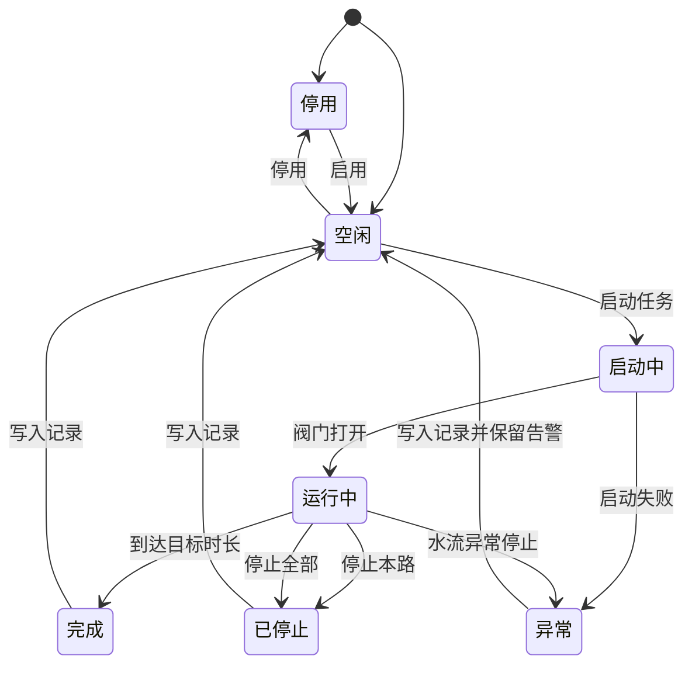
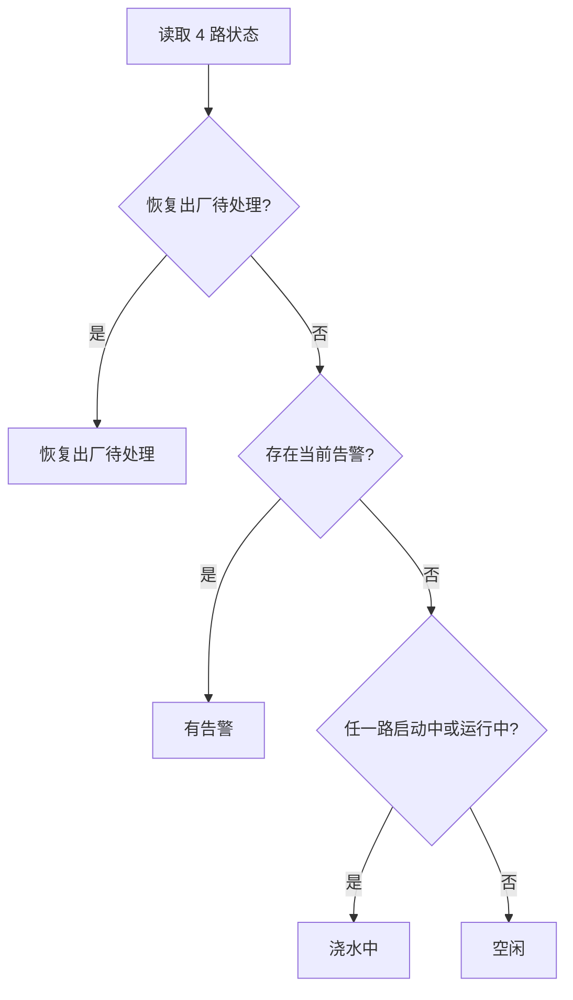
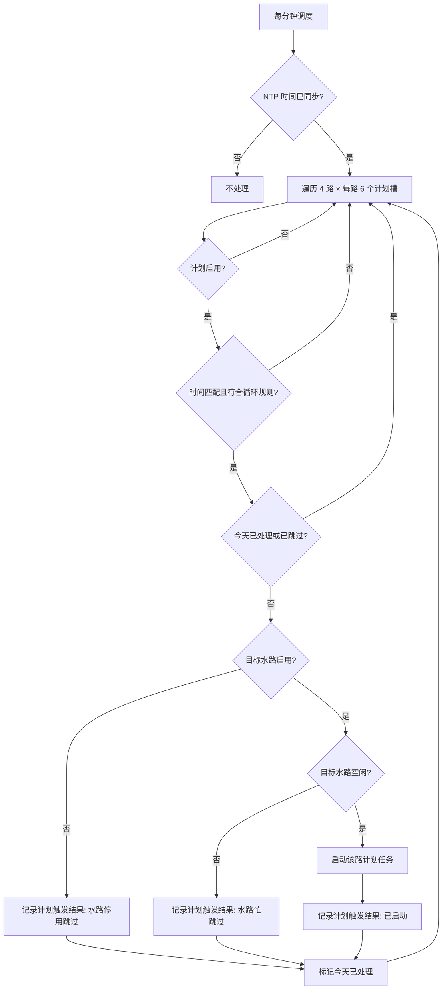
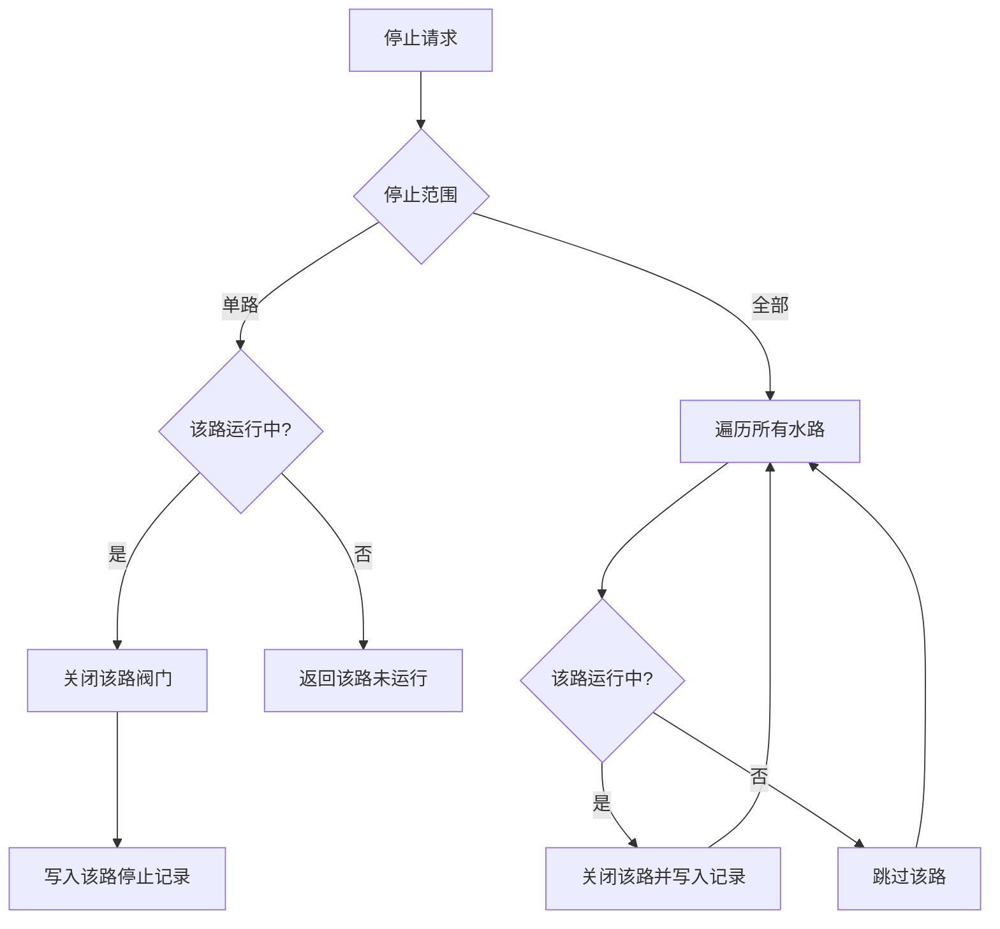
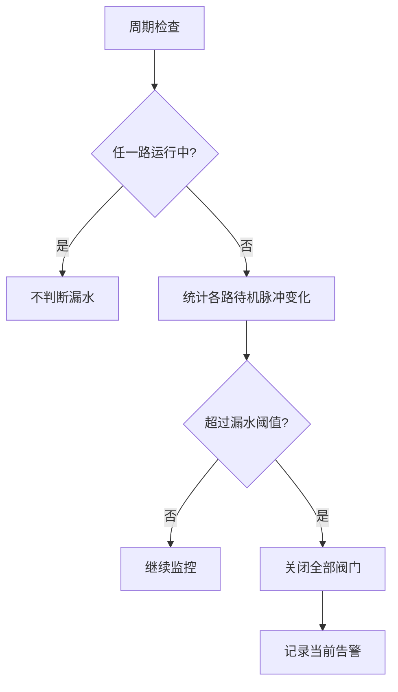

# 灌溉系统核心逻辑说明

本文档定义当前采用的核心业务模型，用于继续核对计划管理、计划执行、手动浇水和水路状态逻辑。代码应持续保持与本文档一致。

最后更新：2026-05-28

## 一、核心模型

系统固定按 4 路水路设计，默认启用第 1、2 路。实际焊接几路，就在软件里启用对应水路。启用状态必须使用 4 bit 掩码保存，而不是保存“启用几路”的数量。

```text
bit0 = 第 1 路
bit1 = 第 2 路
bit2 = 第 3 路
bit3 = 第 4 路

0b0011 = 启用第 1、2 路
0b0101 = 启用第 1、3 路
0b1111 = 启用第 1、2、3、4 路
```

每一路是独立执行单元：

- 独立启用/停用。
- 独立开阀/关阀。
- 独立计时。
- 独立统计流量。
- 独立判断水流异常。
- 独立保存任务记录。

同一路互斥，不同路可并行。也就是说，第 1 路正在计划浇水时，第 2 路如果空闲，仍然可以手动启动。

## 二、固定 4 路板级配置

引脚不开放页面配置，页面只展示每一路固定引脚。后续如果换板子，通过板级配置修改，不让用户在业务页面随意选择 GPIO。

| 水路 | 阀门 PWM 输出 | 流量计脉冲输入 |
| --- | --- | --- |
| 第 1 路 | GPIO16 | GPIO32 |
| 第 2 路 | GPIO14 | GPIO35 |
| 第 3 路 | GPIO13 | GPIO36 |
| 第 4 路 | GPIO27 | GPIO39 |

GPIO35、GPIO36、GPIO39 是输入脚，没有内部上拉；GPIO32 是可输入输出脚，但当前流量计输入统一依赖板级上拉。流量计必须外接或板载上拉。ESP32 GPIO 不能直接驱动电磁阀，阀门 PWM 输出只用于驱动 MOSFET、继电器模块或专用电磁阀驱动器。

## 三、PWM 阀门控制

第一版使用固定 PWM 参数：

```text
开阀启动阶段：100% 占空比
启动保持时间：5 秒
保持阶段：70% 占空比
关阀：0% 占空比
```

70% 是实验默认值，不是最终硬件结论。后续必须根据具体电磁阀、电源、驱动电路、吸合稳定性和温升实测调整。

## 四、水路对象

每一路水路对象包含：

```text
Road
- roadId
- 名称
- 是否启用
- 阀门 PWM 引脚
- 流量计输入引脚
- PWM 参数
- 流量计校准参数
- 当前状态
- 当前任务
- 当前告警
```

水路状态：

```text
停用
空闲
启动中
运行中
完成
已停止
异常
```

## 五、任务对象

任务是某一路的一次浇水动作。手动任务和计划任务使用同一套任务结构。

```text
RoadTask
- taskId
- roadId
- 任务类型：手动 / 计划
- 启动触发来源：Web 页面 / HTTP API / 本地按键 / 计划调度器
- 关联计划槽：计划任务有值，手动任务为空
- 目标时长
- 开始时间
- 结束时间
- 停止触发来源：无 / Web 页面 / HTTP API / 本地按键 / 目标时长到达 / 水流异常检测 / 漏水监控 / 恢复出厂流程
- 停止范围：本路 / 全部 / 无
- 开始脉冲数
- 结束脉冲数
- 估算水量
- 浇水执行结果
```

本地按键不是第三种任务类型。本地按键触发的是手动任务，只是启动触发来源为本地按键。Web 页面和 HTTP API 触发的也是手动任务，但启动触发来源要分别记录，不能合并成一个模糊来源。

## 六、路级状态机



同一路只有在空闲时才能启动新任务。停用水路不能启动任务。

## 七、系统状态

系统状态由 4 路水路状态派生，不单独维护“手动浇水中”和“计划浇水中”。



页面展示时应显示每一路自己的来源，而不是把系统分成“手动浇水中”和“计划浇水中”：

```text
第 1 路：计划浇水中
第 2 路：手动浇水中
第 3 路：空闲
第 4 路：停用
```

## 八、计划模型

计划按水路独立管理。每一路最多 6 条计划。

```text
MaxRoads = 4
MaxPlansPerRoad = 6
最大计划槽 = 4 × 6 = 24
```

每个计划槽只属于一路：

```text
RoadPlan
- roadId
- slotIndex：0..5
- 是否启用
- 启动时间
- 目标时长
- 循环规则
- 最近一次处理日期
```

计划配置页面应按水路组织：

```text
第 1 路
  计划 1
  ...
  计划 6

第 2 路
  计划 1
  ...
  计划 6
```

## 九、同时和顺序

不再需要“同时浇水/顺序浇水”模式。

同时浇水靠相同启动时间表达：

```text
07:00 第 1 路 10 分钟
07:00 第 2 路 10 分钟
```

顺序浇水靠不同启动时间表达：

```text
07:00 第 1 路 10 分钟
07:15 第 2 路 10 分钟
```

这样计划调度器不需要维护多路计划会话，也不需要顺序队列。

## 十、计划调度流程



计划调度只锁定目标水路，不锁定整个系统。

## 十一、手动启动流程


手动启动支持部分成功。例如第 1 路忙、第 3 路空闲，请求启动第 1、3 路时，第 1 路失败，第 3 路启动。

## 十二、停止流程



停止不是新的任务类型，只是结束当前任务的触发动作。停止来源要客观记录为 Web 页面、HTTP API、本地按键或系统自动保护。恢复出厂待处理时仍应允许停止类安全操作。

## 十三、浇水执行结果

浇水执行结果是历史记录的核心字段。每条历史记录对应一路已经实际启动过的浇水任务，这个任务可以来自计划，也可以来自手动。

```text
浇水任务来源 = 计划 / 手动
启动触发来源 = Web 页面 / HTTP API / 本地按键 / 计划调度器
停止触发来源 = 无 / Web 页面 / HTTP API / 本地按键 / 目标时长到达 / 水流异常检测 / 漏水监控 / 恢复出厂流程
停止范围 = 本路 / 全部 / 无
```

浇水执行结果至少包括：

```text
正常完成
用户停止
水流异常停止
漏水保护停止
恢复出厂保护停止
```

含义：

- 正常完成：达到目标时长后自动关阀。
- 用户停止：用户通过 Web 页面、HTTP API 或本地按键提前停止某一路或全部水路。具体是哪一种，记录在停止触发来源中。
- 水流异常停止：运行中超过无脉冲阈值，系统自动关闭该路。
- 漏水保护停止：漏水监控触发保护，系统关闭该路或全部水路。
- 恢复出厂保护停止：恢复出厂流程触发保护，系统关闭该路或全部水路。

示例：

```text
计划任务，启动触发来源=计划调度器，浇水执行结果=用户停止，停止触发来源=Web 页面，停止范围=本路
手动任务，启动触发来源=本地按键，浇水执行结果=正常完成，停止触发来源=目标时长到达，停止范围=本路
计划任务，启动触发来源=计划调度器，浇水执行结果=水流异常停止，停止触发来源=水流异常检测，停止范围=本路
手动任务，启动触发来源=HTTP API，浇水执行结果=用户停止，停止触发来源=本地按键，停止范围=全部
```

没有实际启动的计划，不生成浇水历史记录，只生成计划触发结果。

计划触发结果用于解释“到点后为什么没有形成浇水记录”，至少包括：

```text
已启动
水路停用跳过
水路忙跳过
漏水告警中跳过
恢复出厂待处理跳过
配置无效跳过
```

计划触发结果是浇水执行结果的上游审计信息；浇水执行结果是最终业务事实。

## 十四、记录模型

历史记录按水路任务保存。每条记录对应一路的一次任务。

```text
RoadTaskRecord
- recordId
- roadId
- 任务类型
- 启动触发来源
- 计划槽
- 目标时长
- 开始时间
- 结束时间
- 停止触发来源
- 停止范围
- 浇水执行结果
- 开始脉冲数
- 结束脉冲数
- 估算水量
- 校准参数快照
```

同时浇四路时会产生四条任务记录，而不是一条复杂的多路会话记录。

## 十五、流量统计和异常

每一路运行时独立统计流量：

- 启动时记录开始脉冲数。
- 运行中更新最近脉冲数。
- 结束时记录结束脉冲数。
- 根据该路校准参数估算水量。

水流异常按路判断。某一路运行中超过配置时间没有脉冲变化，就关闭该路并记录水流异常，不直接影响其他水路。

## 十六、漏水监控

漏水监控只在所有水路都未运行、所有阀门都应关闭时启用。



“全局水源异常”是后续增强项：如果多路同时打开且多路都没有流量，可能代表总水阀、水泵、水箱或主管路异常。第一版先按每路水流异常处理。

## 十七、页面边界

首页：

- 显示 4 路当前状态。
- 显示每路固定引脚。
- 支持按路手动启动/停止。
- 支持停止全部。
- 显示当前告警。

近期计划：

- 展示今天、明天、后天的计划槽展开结果。
- 按时间排序。
- 每行对应一路的一条计划。
- 显示计划触发结果和跳过原因。

计划配置：

- 按水路分组。
- 每路 6 条计划。
- 不再配置同时/顺序模式。

灌溉设置：

- 显示 4 路固定引脚。
- 每路可改名称。
- 每路可启用/停用。
- PWM 参数第一版固定展示，不开放修改。

历史记录：

- 显示水路任务记录。
- 不显示系统事件。

## 十八、安全规则

1. 启动初始化必须关闭所有阀门。
2. 停用水路不能启动任务。
3. 同一路不能同时运行两个任务。
4. 不同路可以并行运行。
5. 每个任务必须有目标时长，不允许永久开启。
6. 停止全部必须关闭所有运行水路，并逐路记录停止触发来源和停止范围。
7. 恢复出厂待处理时仍允许停止类安全操作。
8. 水流异常只关闭异常水路。
9. 待机漏水告警关闭全部阀门。
10. 历史记录保存事实，不随当前配置重新解释。

## 十九、实现校验点

后续修改必须持续满足：

- `MaxRoads = 4`。
- 默认启用掩码为 `0b0011`。
- 每路最多 6 条计划，总计划槽为 24。
- 不恢复同时/顺序模式。
- 运行时以路级任务为唯一执行对象。
- 手动启动逐路判断，允许部分成功。
- 历史记录按路级任务保存。
- 页面按 4 路固定水路展示。
- 计划触发结果和浇水执行结果必须可追溯。
